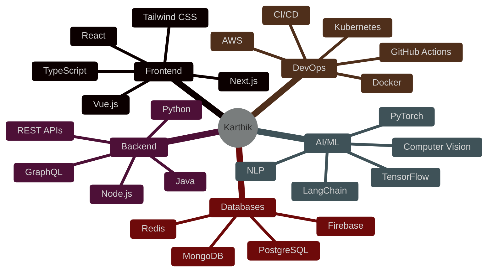

<div align="center">

<!-- Animated Header -->


<!-- Typing Animation -->
<p align="center">
  
</p>

<!-- Animated Badges -->
<p align="center">
  
  
  
</p>

<!-- Cool Divider -->


</div>

<!-- About Me Section -->
## 🚀 About Me

```typescript
const karthik = {
    location: "Vijayawada, Andhra Pradesh 📍",
    role: "Full Stack Developer & AI Enthusiast",
    code: ["TypeScript", "JavaScript", "Python", "Java", "C++"],
    technologies: {
        frontEnd: {
            js: ["React", "Next.js", "Vue.js"],
            css: ["Tailwind", "Bootstrap", "Material-UI", "Styled-Components"]
        },
        backEnd: {
            js: ["Node.js", "Express", "Nest.js"],
            python: ["Django", "Flask", "FastAPI"],
            java: ["Spring Boot"]
        },
        databases: ["MongoDB", "PostgreSQL", "MySQL", "Redis", "Firebase"],
        ai_ml: ["TensorFlow", "PyTorch", "Scikit-learn", "LangChain"],
        devOps: ["Docker", "Kubernetes", "AWS", "GitHub Actions", "Vercel"],
        tools: ["Git", "VS Code", "Postman", "Figma"]
    },
    currentFocus: "Building AI-powered applications that make a difference",
    lifePhilosophy: "Code is poetry, bugs are just plot twists 🎭",
    funFact: "I debug in my dreams and wake up with solutions! 💡"
};
```

<div align="center">

<!-- Animated Divider -->


</div>

<!-- What I'm Up To -->
## 🎯 What I'm Currently Doing

<table>
<tr>
<td width="50%">

### 🔥 Building
- 🤖 **AI-Powered Applications** with cutting-edge ML models
- 🌐 **Full-Stack Web Apps** that scale beautifully
- 🎨 **Interactive UI/UX** experiences that wow users
- 📊 **Data Visualization** tools for insights
- 🚀 **Open Source** contributions to amazing projects

</td>
<td width="50%">

### 📚 Learning
- 🧠 Advanced **Machine Learning** algorithms
- ⚡ **System Design** & Architecture patterns
- 🔐 **Web3** & Blockchain development
- 🎮 **Game Development** with Unity
- ☁️ **Cloud Architecture** optimization

</td>
</tr>
</table>

<div align="center">

<!-- Animated Divider -->


</div>

<!-- Tech Stack Section -->
## 🛠️ Tech Arsenal

<div align="center">

### 👨‍💻 Languages


### 🎨 Frontend Development


### ⚙️ Backend Development


### 🗄️ Databases & Cloud


### 🤖 AI/ML & Data Science


### ☁️ DevOps & Tools


</div>

<div align="center">

<!-- Animated Divider -->


</div>

<!-- GitHub Stats -->
## 📊 GitHub Analytics

<div align="center">
  


</div>

<!-- GitHub Trophies -->
<div align="center">
  
### 🏆 GitHub Trophies

[](https://github.com/ryo-ma/github-profile-trophy)

</div>

<div align="center">

<!-- Animated Divider -->


</div>

<!-- Featured Projects -->
## 🌟 Featured Projects

<div align="center">

<a href="https://github.com/ckarthik77/karthik-s-portfolio">
  
</a>

</div>

<table align="center">
<tr>
<td width="50%" valign="top">

### 🤖 AI-Powered Portfolio
**Interactive AI demonstrations including:**
- 🌦️ Weather Dashboard with AI insights
- 📚 RAG System for document Q&A
- 💼 Job Search AI with recommendations
- 🏙️ SynCity urban simulator
- 🚦 Real-time sign detection

**Tech:** Next.js, TypeScript, TensorFlow.js, AI/ML

[🔗 Live Demo](https://karthik-portfolio-hx2iszk03-luffys-projects-7a77377d.vercel.app) | [📝 View Code](https://github.com/ckarthik77/karthik-s-portfolio)

</td>
<td width="50%" valign="top">

### 🎨 Creative Features
**Stunning visual experiences:**
- 🌌 Neural network background
- 📡 Interactive radar visualization
- 💻 Terminal CLI interface
- 🔊 Interactive sound system
- ✨ Cyber-luxe design system

**Tech:** React, Framer Motion, Three.js, Canvas API

[🔗 Explore](https://karthik-portfolio-hx2iszk03-luffys-projects-7a77377d.vercel.app)

</td>
</tr>
</table>

<div align="center">

<!-- Animated Divider -->


</div>

<!-- Coding Stats -->
## ⚡ Coding Activity

<div align="center">

<!--START_SECTION:waka-->


<!--END_SECTION:waka-->

</div>

```text
🌅 Morning     ████████░░░░░░░░░░░░░   32.5%
🌆 Daytime     ██████████████░░░░░░░   58.2%
🌃 Evening     ████░░░░░░░░░░░░░░░░░   18.3%
🌙 Night       ████████████░░░░░░░░░   45.8%

💻 Most Used Languages:
TypeScript   ████████████████░░░░░   65.4%
JavaScript   ██████░░░░░░░░░░░░░░░   24.2%
Python       ████░░░░░░░░░░░░░░░░░   15.8%
Java         ██░░░░░░░░░░░░░░░░░░░    8.3%
Other        ██░░░░░░░░░░░░░░░░░░░    6.3%
```

<div align="center">

<!-- Animated Divider -->


</div>

<!-- Skills Visualization -->
## 💪 Skill Levels

<div align="center">



</div>

<div align="center">

<!-- Animated Divider -->


</div>

<!-- Achievements -->
## 🎯 Achievements & Milestones

<div align="center">

| Achievement | Status | Details |
|------------|--------|---------|
| 🎓 **Problem Solver** | ✅ Achieved | 500+ LeetCode/HackerRank problems solved |
| 🚀 **Project Builder** | ✅ Achieved | 20+ full-stack projects deployed |
| 🤖 **AI Enthusiast** | ✅ Achieved | 5+ AI/ML projects in production |
| ⭐ **Open Source** | 🔄 In Progress | Contributing to major repositories |
| 📝 **Tech Writer** | 🔄 In Progress | Sharing knowledge through blogs |
| 🎤 **Speaker** | 🎯 Goal | Presenting at tech conferences |

</div>

<div align="center">

<!-- Animated Divider -->


</div>

<!-- Fun Section -->
## 🎮 When I'm Not Coding

<table>
<tr>
<td width="50%">

### 🎯 Interests
- 🎮 Gaming (Strategy & RPG)
- 📚 Reading Tech Blogs & Sci-Fi
- 🎵 Music (Lo-fi while coding)
- 🎨 UI/UX Design Exploration
- 🧩 Solving Puzzles & Brain Teasers
- 🌱 Learning New Technologies

</td>
<td width="50%">

### 💭 Philosophy
> *"The best way to predict the future is to invent it."*
> 
> **My Approach:**
> - 🎯 Write clean, maintainable code
> - 🚀 Build for scale from day one
> - 🤝 Collaborate and learn constantly
> - 💡 Innovation over imitation
> - 🌟 User experience is everything

</td>
</tr>
</table>

<div align="center">

<!-- Animated Divider -->


</div>

<!-- Snake Animation -->
## 🐍 Watch My Contributions Get Eaten!

<div align="center">
  


</div>

<div align="center">

<!-- Animated Divider -->


</div>

<!-- Connect Section -->
## 🤝 Let's Connect & Collaborate!

<div align="center">

### 💬 I'm always open to:
🚀 Interesting project collaborations | 💼 Full-time opportunities | 🎯 Freelance projects | 🧠 Tech discussions | 📚 Knowledge sharing

<br>

### 📫 Reach Me At:

[](https://www.linkedin.com/in/karthikeya-chandika)
[](https://twitter.com/ckarthik77)
[](https://instagram.com/ckarthik77)
[](mailto:your.email@gmail.com)
[](https://discord.com/users/yourid)
[](https://karthik-portfolio-hx2iszk03-luffys-projects-7a77377d.vercel.app)

<br>

### 💼 Professional Services

<table>
<tr>
<td align="center" width="33%">
  
**🎨 Web Development**
<br>
Full-stack applications
<br>
Modern, responsive designs
<br>
<sub>React • Next.js • Node.js</sub>

</td>
<td align="center" width="33%">

**🤖 AI/ML Solutions**
<br>
Custom AI models
<br>
Data analysis & insights
<br>
<sub>TensorFlow • PyTorch</sub>

</td>
<td align="center" width="33%">

**☁️ Cloud & DevOps**
<br>
Infrastructure setup
<br>
CI/CD pipelines
<br>
<sub>AWS • Docker • K8s</sub>

</td>
</tr>
</table>

</div>

<div align="center">

<!-- Animated Divider -->


</div>

<!-- Support Section -->
## ☕ Support My Work

<div align="center">

If you find my projects helpful or interesting, consider supporting me:

[](https://www.buymeacoffee.com/ckarthik77)
[](https://paypal.me/ckarthik77)
[](https://github.com/sponsors/ckarthik77)

**Your support helps me:**
- 🚀 Build more open-source projects
- 📚 Create educational content
- 💡 Experiment with new technologies
- 🎯 Dedicate more time to community contributions

</div>

<div align="center">

<!-- Animated Divider -->


</div>

<!-- Quote Section -->
<div align="center">

### 💭 Random Dev Quote


</div>

<div align="center">

### 😂 Developer Humor


</div>

<div align="center">

<!-- Animated Divider -->


</div>

<!-- Footer -->
<div align="center">

### ⭐ Star My Repos If You Find Them Useful!

### 🙏 Thanks for Visiting!


<br>

**Made with ❤️ by Karthik**

<br>

<!-- Footer Wave -->


</div>
